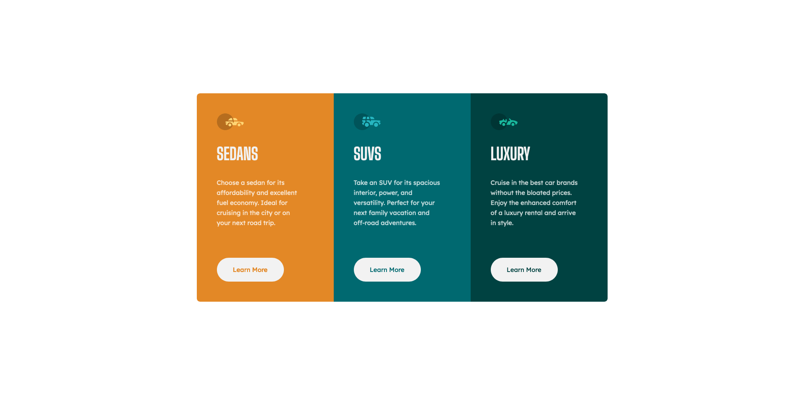
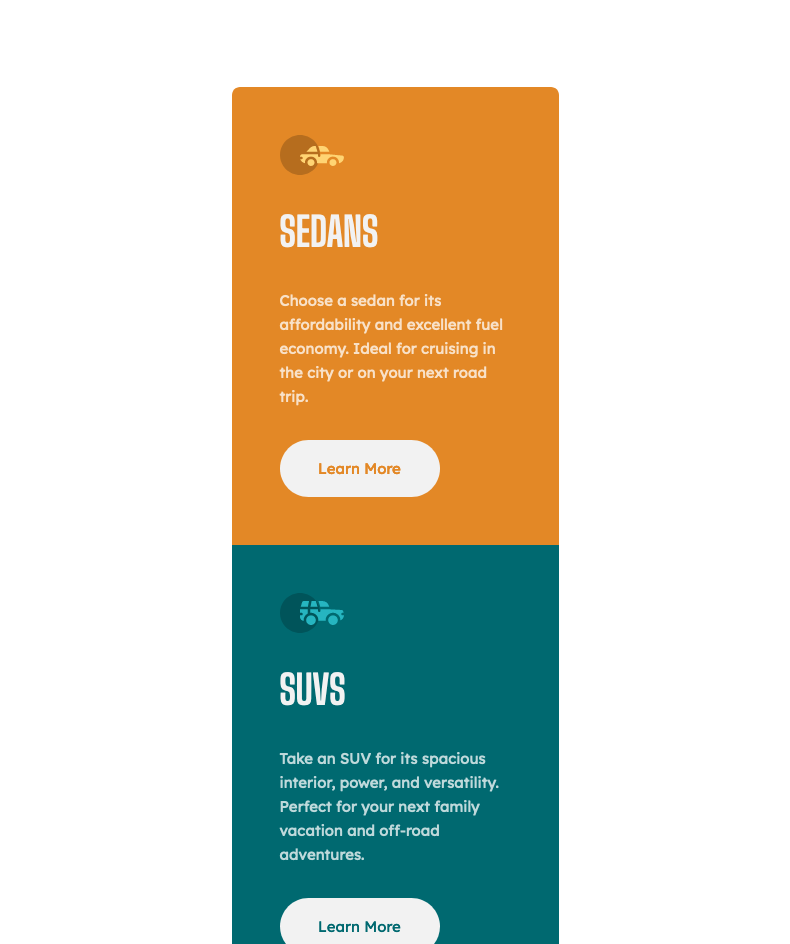

# Frontend Mentor - 3-column preview card component solution

This is a solution to the [3-column preview card component challenge on Frontend Mentor](https://www.frontendmentor.io/challenges/3column-preview-card-component-pH92eAR2-). Frontend Mentor challenges help you improve your coding skills by building realistic projects. 

## Table of contents

- [Overview](#overview)
  - [Screenshots](#screenshots)
  - [Links](#links)
- [My process](#my-process)
  - [Built with](#built-with)
- [Mentions](#mentions)
- [Author](#author)

---

## Overview

### Screenshots
Desktop

Mobile

### Links

- Solution Frontend Mentor: [Frontend solution](https://www.frontendmentor.io/solutions/3column-card-tkMO8TTvug)
- Live Site: [Live site with GitHub Pages](https://marioferrer.github.io/-FM-07_column-card/)

## My process

### Built with

- HTML5
- BEM
- SCSS
- Flexbox
- Grid

### Mentions

I have used and modified Eduardo Fierro's reset, here is his github profile.  
[Eduardo's github profile](https://github.com/eduardofierropro/Reset-CSS)

## Author

- Github - [My GitHub Profile](https://github.com/marioferrer)
- Frontend Mentor - [@marioferrer](https://www.frontendmentor.io/profile/marioferrer)

